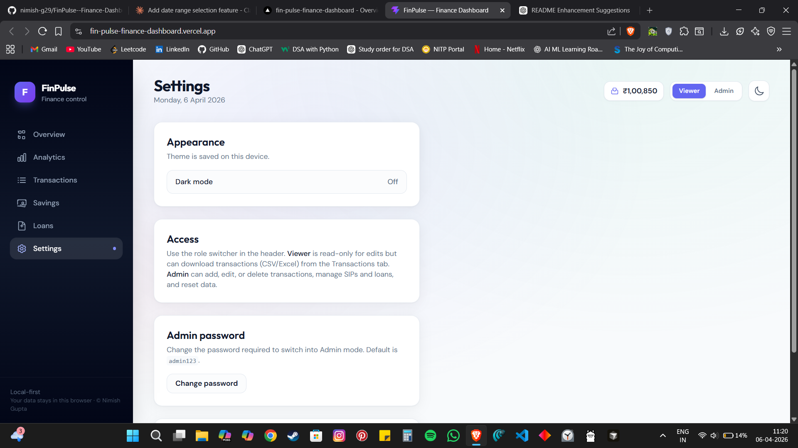

# FinPulse — Personal Finance Dashboard

A local-first personal finance dashboard built with React.  
Track income, expenses, SIP investments, and loans with analytics — all stored securely in your browser.

No backend. No cloud. Fully client-side.

---

## Live Demo  
https://fin-pulse-finance-dashboard.vercel.app/

---

## Features

### Dashboard
- Net balance overview  
- Income and expense stat cards  
- Cash flow chart  
- Category-wise spending (pie chart)  
- Recent transactions table  

### Transactions
- Full ledger with:
  - Search and filters  
  - Sorting  
  - Type-based filtering  
- Click any row to view/edit  
- Export data to CSV or Excel  

### Analytics
- Monthly income vs expense bar chart  
- Balance trend over time  
- Expense distribution insights  
- Category ranking breakdown  

### Savings (SIP)
- Track multiple SIP plans  
- Projected corpus calculation  
- Growth visualization chart  
- Maturity insights  

### Loans
- EMI calculator  
- Amortization schedule  
- Outstanding balance tracker  
- Principal vs interest breakdown  

### Date Range Filter
- Filter by month or custom date range  
- Applies across dashboard, analytics, and transactions  

### UI & Experience
- Dark mode (saved locally)  
- Clean and responsive design  

### Roles & Access
- Viewer mode — read-only  
- Admin mode — full control  

### Admin Security
- Password-protected admin access  
- Default password: `admin123`  
- Changeable from settings  

---

## Tech Stack

- React 19  
- Vite  
- Tailwind CSS  
- Recharts  
- SheetJS (xlsx)  

---

## Getting Started

### Install dependencies
```bash
npm install
```

### Run development server
```bash
npm run dev
```

### Build for production
```bash
npm run build
```

---

## Usage

- App opens in Viewer mode  
- Click Admin (top-right) and enter password (`admin123`)  
- Use Load Sample Data to explore features  
- All data is stored locally in your browser  

---

## Data & Storage

- Uses localStorage (no backend or database)  
- Data persists across sessions  
- Clearing browser data resets everything  

---

## Notes

- This is a client-side demo project  
- Admin authentication is not secure for production use  
- No data is sent to any server  

---

## Future Improvements

- Cloud sync and authentication  
- Multi-device support  
- Budget planning module  
- AI-based spending insights  
- Mobile app version  

---

## Screenshots

### Settings

